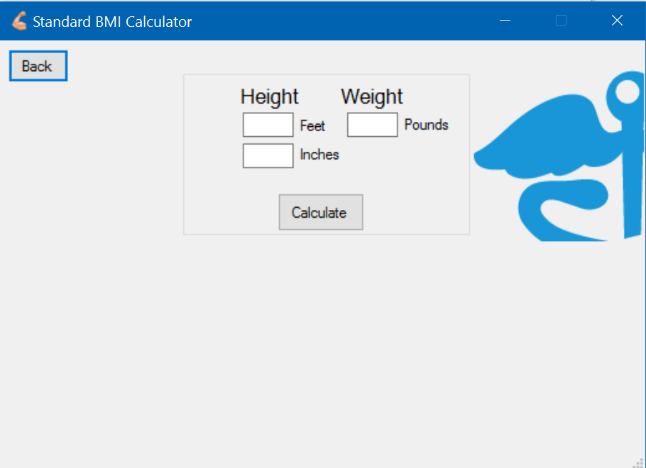

# BMI
Calculates Body Mass Index

## What is BMI
BMI stands for body mass index. BMI is a weight to height ratio, this is calculated by dividing weight by height. This allows your BMI to be in one of three categories, underweight, overweight,or obese.

## About The Program
This program can calculate the BMI of the user in either metric or standard units based on the height and weight inputs that the user provided. This program is coded in C# and was created in Visual Studio 2015 so forms could be used for the GUI.

## Motivation
This program was created to increase efficiency for medical professional working in the fast paced medical environment.

